# 최준용 | Unity Client Programmer Portfolio
 
현재 프로젝트들 중 최신 코드인 이터널리턴 모작은 공개 레포입니다.
 
## Links

- [포트폴리오 슬라이드](https://docs.google.com/presentation/d/1SHUQ0SqXn_fEd9ADrQZdwc3U0G9s6_ygepJbTRUxDiA/edit)
- [GitHub](https://github.com/Aki1304)
- Email: gugu1304@naver.com

 

## Projects

| 프로젝트 | 설명 | 인원 | 기간 | 주요 기술 |
| --- | --- | ---: | --- | --- |
| [Eternal Return Study Project](#01-eternal-return-study-project) | 상용 MOBA 시스템 구조 학습 및 모작 | 1명 | 2026.05 ~ 2026.08 | Unity, C#, Google Sheets, Apps Script |
| [Loop Project](#02-loop-project) | 모바일 2D 턴제 전투 구조 학습 | 1명 | 2025.06 ~ 2025.09 | Unity, C#, Sprite Atlas |
| [Souls-like Action Game Study](#03-souls-like-action-game-study) | 액션 게임 전투와 몬스터 AI 학습 | 1명 | 2025.02 ~ 2025.06 | Unity, C#, FSM, NavMesh |
| [DeadLine](#04-deadline) | Photon PUN2 기반 멀티플레이 팀 프로젝트 | 4명 | 2024.07 ~ 2025.01 | Unity, C#, Photon PUN2 |

[ToyProject](#05-toyproject) (간단한 Blender 활용 모델링 프로젝트)
 

## 01. Eternal Return Study Project

> 상용 게임에서는 데이터, 캐릭터 행동, 시야와 맵 시스템을 어떤 구조로 구현할지 고민하며 제작한 이터널 리턴 모작 프로젝트입니다.

- 개발 인원: 1명
- 플랫폼: PC
- 개발 환경: Unity 6, C#
- Repository: [EternalReturn_Practice](https://github.com/Aki1304/EternalReturn_Practice)
- Youtube : https://youtu.be/kCqTue54SZ0?si=9oJ0Eq9rRqeJSAuQ

  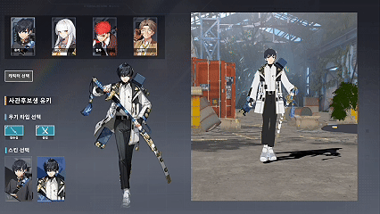

  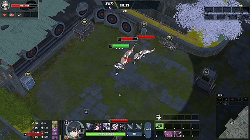

### 프로젝트 목표

상용 MOBA의 데이터·맵·캐릭터 시스템이 하나의 게임 흐름으로 연결되는 구조를 학습하는 데 집중했습니다.

### 핵심 구현

#### 데이터 파이프라인

- Google Sheets의 아이템·제작 데이터를 CSV로 가져와 ScriptableObject로 변환하는 에디터 도구를 구현했습니다.
- 헤더·필드 매핑과 타입 파싱을 자동화하고, 런타임 데이터는 Dictionary로 가공해 캐싱했습니다.

#### 제작 트리와 자동 루트 생성

- 제작식을 `결과 아이템 → 재료 아이템`으로 역조회하고, 재귀 탐색으로 최하위 재료와 수량을 누적했습니다.
- 재료·이동·완성 점수를 평가해 단계별 상위 5개 후보만 유지하는 Beam Search를 적용했습니다.
- 생성한 루트는 Apps Script로 저장·조회하고 게임의 제작 가이드와 맵 UI에 전달했습니다.

#### Fog of War와 금지구역

- 월드 좌표를 byte Grid로 변환해 Fog, 몬스터, 아이템, UI와 지붕이 동일한 가시성 결과를 사용하도록 연결했습니다.
- AreaConnectionSO를 양방향 그래프로 구성하고, 다중 시작점 BFS 결과로 페이즈별 금지구역을 생성했습니다.

#### Command, State, Combat 역할 분리

- State에 섞여 있던 행동의 시작·갱신·종료 흐름을 ICommand로 분리했습니다.
- Command는 행동 의도, State는 실행 상태와 애니메이션, Move·Combat은 실제 기능 처리를 담당합니다.
- 플레이어와 RioBot이 같은 Command를 사용하도록 구성했습니다.

### 설계 과정에서 고민한 점

| 문제 | 선택한 방법 | 결과 |
| --- | --- | --- |
| 기획 데이터 변경마다 Unity 데이터를 직접 수정 | Sheets·CSV·ScriptableObject 에디터 파이프라인 구성 | 데이터 반영 과정 단순화 |
| 루트 후보가 탐색 단계마다 증가 | Beam Search로 상위 5개 후보 유지 | 제한된 후보에서 플레이 가능한 루트 생성 |
| 연결 관계에 따른 금지구역 순서가 필요 | 양방향 그래프와 다중 시작점 BFS 사용 | 거리 기준으로 페이즈별 금지구역 생성 |
| State가 행동 흐름까지 담당 | ICommand로 흐름을 분리하고 State는 상태 표현에 집중 | 플레이어와 AI가 행동 흐름을 재사용 |

 

## 02. Loop Project

> 모바일 2D 턴제 전투의 순서 관리와 전투 흐름을 학습하기 위해 제작한 개인 프로젝트입니다.

- 개발 인원: 1명
- 플랫폼: Mobile
- 개발 환경: Unity, C#
- Repository: Private
- Youtube : https://youtu.be/DO8OVmF7ktM?si=1LZChDbS9dUcNn8v&t=42

  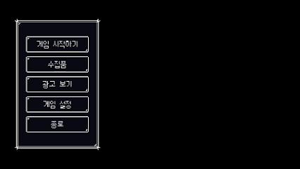

  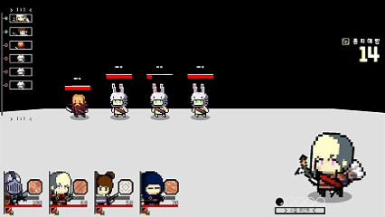

### 핵심 구현

- 생존 유닛을 속도순으로 정렬하고 행동 완료 시 다음 턴으로 전환하는 Turn Manager
- 전투 중 사망한 유닛을 남은 턴 목록에서 제거
- 조건부 추가 턴을 기존 입력·스킬·애니메이션 흐름에 연결
- Sprite Atlas 적용 후 Unity Statistics로 배칭 동작 확인

### 설계 과정에서 고민한 점

- 사망 유닛의 턴 재실행을 막기 위해 사망 처리와 TurnList 갱신을 연결했습니다.
- 추가 턴도 기존 턴 흐름으로 진입시켜 전투 로직의 중복을 줄였습니다.
- Sprite Atlas 적용에 그치지 않고 동일 조건의 스프라이트가 배칭되는지 확인했습니다.

 

## 03. Action Game Study

> 액션 게임의 타깃 고정, 몬스터 AI, 콤보와 타이밍 패링 구조를 학습하기 위해 제작한 개인 프로젝트입니다.

- 개발 인원: 1명
- 플랫폼: PC
- 개발 환경: Unity, C#
- Repository: Private
- Youtube : https://youtu.be/nLi7oov9DWY?si=lmpznlu7PVDNC0PD&t=18

  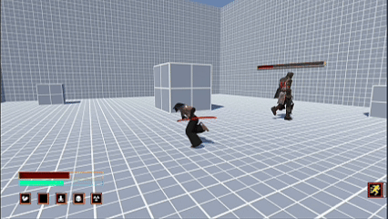

### 핵심 구현

- Patrol·Battle·Die로 구분한 몬스터 FSM과 NavMeshAgent 추적
- 타깃 고정, 대상 HP UI와 콤보 전투
- OverlapSphere 이후 거리·시야각·장애물을 검사하는 시야 판정
- Animation Event로 패링 가능 시간과 범위·각도를 판정하는 타이밍 패링

### 설계 과정에서 고민한 점

- 하나의 Update에 모였던 몬스터 행동을 State의 진입·갱신·전환 조건으로 분리했습니다.
- 패링은 입력뿐 아니라 공격 가능 시간, 거리와 각도를 모두 만족하도록 구성했습니다.
- 실제 시야 판정 범위를 Gizmo와 Debug.DrawLine으로 표시해 조정 과정을 단순화했습니다.

 

## 04. DeadLine

> Photon PUN2의 룸 접속부터 게임 진행과 정산까지 멀티플레이 흐름을 설계한 팀 프로젝트입니다.

- 개발 인원: 4명
- 플랫폼: PC
- 개발 환경: Unity, C#, Photon PUN2
- 담당: Manager 시스템, 네트워크 초기 연결 및 룸 흐름, Cart 시스템 대부분
- Repository: Private
- Youtube : https://youtu.be/4slfdKWWfHA?si=9YHdmNzAxMdbFUQt

  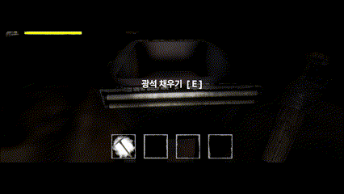

  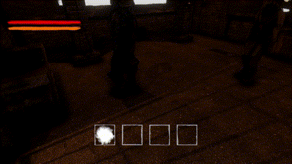

### 담당 및 핵심 구현

- Photon 서버 접속, 방 생성·참가, 씬 전환과 종료 흐름 구현
- NetworkManager·PlayerManager·GameManager 역할 구분
- MasterClient가 정산과 공유 결과를 계산해 RPC로 전달하는 구조 구성
- Cart 이동 조건·속도·경로와 바퀴 상태 동기화
- 레버·버튼·광물 적재 이벤트와 MasterClient 퇴장 순서 처리

### 네트워크 구조에서 고민한 점

- 클라이언트별 결과 차이를 막기 위해 MasterClient를 공유 결과의 단일 판단 주체로 사용했습니다.
- 위치·회전 같은 연속 상태는 PhotonTransformView, 단발성 상호작용은 RPC로 구분했습니다.
- Photon 콜백 순서를 흐름도로 정리해 룸 접속부터 정산·종료까지의 작업 기준을 팀과 공유했습니다.

 

#### 5. ToyProject — 칼바람 나락 모델링

간단한 Blender 모델링 활용 프로젝트

### 칼바람 나락 모델링

> Blender의 기본 모델링 작업과 Unreal Engine 5의 에셋 임포트 과정을 경험하기 위해 진행한 개인 학습 프로젝트입니다.

| 구분 | 내용 |
| --- | --- |
| 목적 | 3D 모델링 작업 과정에 대한 최소한의 이해 및 Unreal Engine 5 사용 경험 |
| 개발 기간 | 2022.10 ~ 2023.12 |
| 사용 도구 | Blender, Unreal Engine 5 |
| 개발 인원 | 1명 |
| 담당 업무 | 칼바람 나락 맵 모델링, UE5 임포트 및 카메라 영상 제작 |

### 구현 내용

Blender의 점·선·면을 활용한 기본 모델링 과정을 학습하고, 이를 바탕으로 리그 오브 레전드의 칼바람 나락 맵을 직접 제작했습니다. 완성한 모델을 Unreal Engine 5로 임포트한 뒤 카메라를 배치하여 결과 영상을 제작했습니다.

- Youtube : https://youtu.be/QddiAWlEwGE?si=CZX9smcTxLFwccXK

  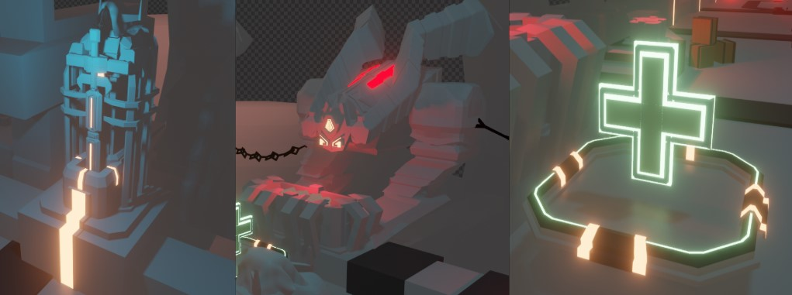

  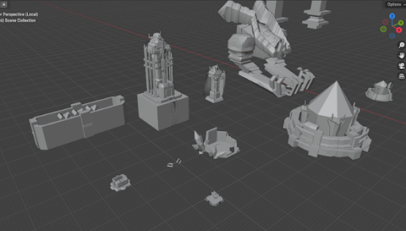
  &nbsp;&nbsp;
  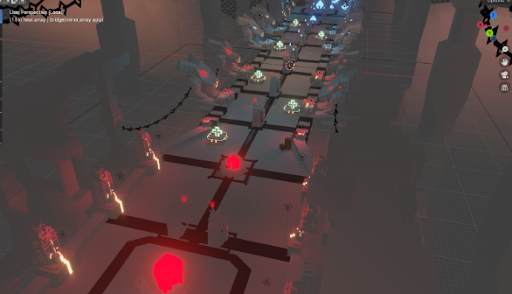

  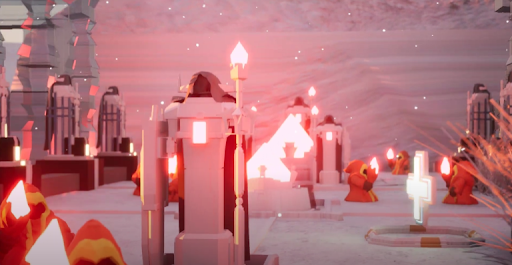

### 회고

영상 일부에서 서로 겹치거나 지나치게 가까운 면의 깊이 판정이 충돌하여 깜빡이는 현상이 발생했습니다. 당시 모델을 얇은 평면 위주로 제작하면서 중복 면과 노멀 방향을 충분히 확인하지 못한 것이 원인이었습니다.

결과물을 완성하는 데 집중한 나머지 리토폴로지와 버텍스 수를 고려하지 않아 메시가 불필요하게 복잡해지는 문제를 경험했습니다.
이를 통해 실시간 게임용 모델은 외형뿐 아니라 토폴로지와 폴리곤 수, 엔진에서의 렌더링 비용까지 고려해 제작해야 한다는 점을 배웠습니다.

또한 직접 모델링 과정을 경험하며 하나의 에셋을 완성하기까지 많은 시간과 반복 작업이 필요하다는 점을 이해했습니다. 
이 과정에서 기본적인 모델링 용어와 제작 흐름을 익혔으며, 이후 3D 아티스트와 작업 범위나 수정 사항을 소통할 때 상대 직군의 작업 과정을 간소하게나마 고려할 수 있게 되었습니다.

---

이 저장소는 Unity 클라이언트 프로그래머 포트폴리오를 정리하기 위한 저장소입니다.

Eternal Return Study Project는 시스템 구조 학습을 목적으로 제작한 비상업적 모작 프로젝트이며, 원작의 상표와 리소스에 대한 권리는 해당 권리자에게 있습니다.
